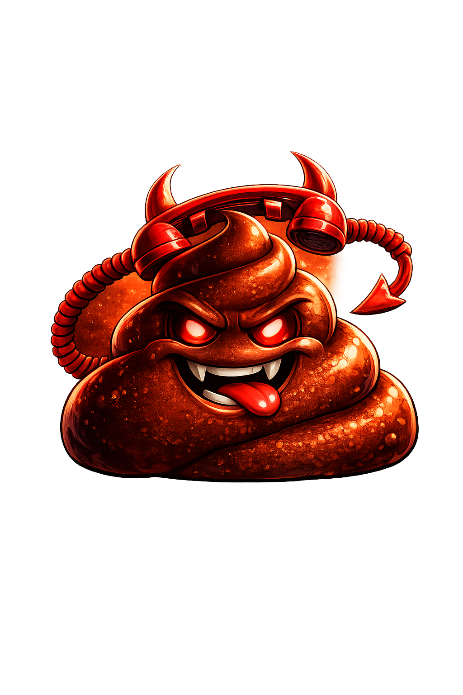

# shitter

<p align="center">
  
</p>

`shitter` is a native iOS + Android client for Codex.

## Repository layout

- `apps/ios`: iOS app (`LitterRemote` and `Litter` schemes)
- `apps/android`: Android app
  - `app`: Compose UI shell, app state, server manager, SSH/auth flows
  - `core/bridge`: native bridge bootstrapping and core RPC client
  - `core/network`: discovery services (Bonjour/Tailscale/LAN probing)
  - `docs/qa-matrix.md`: Android parity QA matrix
- `shared/rust-bridge/codex-bridge`: shared Rust bridge crate
- `shared/third_party/codex`: upstream Codex submodule
- `patches/codex`: local Codex patch set
- `tools/scripts`: cross-platform helper scripts

iOS supports:

- `LitterRemote`: remote-only mode (default scheme; no bundled on-device Rust server)
- `Litter`: includes the on-device Rust bridge (`codex_bridge.xcframework`)

Generated iOS framework artifacts under `apps/ios/Frameworks/` are not stored in git.
Bootstrap them locally before building:

```bash
./apps/ios/scripts/download-ios-system.sh
./apps/ios/scripts/build-rust.sh
```

## Prerequisites

- Xcode.app (full install, not only CLT)
- Rust + iOS targets:
  ```bash
  rustup target add aarch64-apple-ios aarch64-apple-ios-sim x86_64-apple-ios
  ```
- `xcodegen` (for regenerating `Litter.xcodeproj`):
  ```bash
  brew install xcodegen
  ```

## Codex source (submodule + patch)

This repo now vendors upstream Codex as a submodule:

- `shared/third_party/codex` -> `https://github.com/openai/codex`

On-device iOS exec hook changes are kept as a local patch:

- `patches/codex/ios-exec-hook.patch`

Sync/apply patch (idempotent):

```bash
./apps/ios/scripts/sync-codex.sh
```

## Build the Rust bridge

```bash
./apps/ios/scripts/build-rust.sh
```

This script:

1. Syncs `shared/third_party/codex` and applies the iOS hook patch
2. Builds `shared/rust-bridge/codex-bridge` for device + simulator targets
3. Repackages `apps/ios/Frameworks/codex_bridge.xcframework`

## Build and run iOS app

Regenerate project if `apps/ios/project.yml` changed:

```bash
xcodegen generate --spec apps/ios/project.yml --project apps/ios/Litter.xcodeproj
```

Open in Xcode:

```bash
open apps/ios/Litter.xcodeproj
```

Schemes:

- `LitterRemote` (default): no on-device Rust bridge
- `Litter`: uses bundled `codex_bridge.xcframework`

CLI build example:

```bash
xcodebuild -project apps/ios/Litter.xcodeproj -scheme LitterRemote -configuration Debug -destination 'platform=iOS Simulator,name=iPhone 17 Pro' build
```

## Build and run Android app

Prerequisites:

- Java 17
- Android SDK + build tools for API 35
- Gradle 8.x (or wrapper, once added)

Build Android flavors:

```bash
gradle -p apps/android :app:assembleOnDeviceDebug :app:assembleRemoteOnlyDebug
```

Run Android unit tests:

```bash
gradle -p apps/android :app:testOnDeviceDebugUnitTest :app:testRemoteOnlyDebugUnitTest
```

Start emulator and install on-device debug build:

```bash
ANDROID_SDK_ROOT=/opt/homebrew/share/android-commandlinetools \
  $ANDROID_SDK_ROOT/emulator/emulator -avd litterApi35

adb -e install -r apps/android/app/build/outputs/apk/onDevice/debug/app-onDevice-debug.apk
adb -e shell am start -n com.sigkitten.litter.android/com.litter.android.MainActivity
```

Build Android Rust JNI libs (optional bridge runtime step):

```bash
./tools/scripts/build-android-rust.sh
```

## TestFlight (iOS)

1) Authenticate `asc` once with your App Store Connect API key:

```bash
asc auth login \
  --name "Shitter ASC" \
  --key-id "<KEY_ID>" \
  --issuer-id "<ISSUER_ID>" \
  --private-key "$HOME/AppStore.p8" \
  --network
```

2) Bootstrap TestFlight defaults (internal group, optional review contact metadata):

```bash
APP_BUNDLE_ID=<BUNDLE_ID> \
./apps/ios/scripts/testflight-setup.sh
```

3) Build and upload to TestFlight:

```bash
APP_BUNDLE_ID=<BUNDLE_ID> \
APP_STORE_APP_ID=<APP_STORE_CONNECT_APP_ID> \
TEAM_ID=<APPLE_TEAM_ID> \
ASC_KEY_ID=<KEY_ID> \
ASC_ISSUER_ID=<ISSUER_ID> \
ASC_PRIVATE_KEY_PATH="$HOME/AppStore.p8" \
MARKETING_VERSION=1.0.0 \
./apps/ios/scripts/testflight-upload.sh
```

Notes:
- `testflight-upload.sh` auto-increments build number from the latest App Store Connect build.
- It archives, exports an IPA, uploads via `asc builds upload`, and assigns the build to `Internal Testers` by default.
- Override `SCHEME` to `LitterRemote` if you are shipping the remote-only target.

## Important paths

- `apps/ios/project.yml`: source of truth for Xcode project/schemes
- `shared/rust-bridge/codex-bridge/`: Rust staticlib wrapper exposing `codex_start_server`/`codex_stop_server`
- `shared/third_party/codex/`: upstream Codex source (submodule)
- `patches/codex/ios-exec-hook.patch`: iOS-specific hook patch applied to submodule
- `apps/ios/Sources/Litter/Bridge/`: Swift bridge + JSON-RPC client
- `apps/android/app/src/main/java/com/litter/android/ui/`: Android Compose UI shell and screens
- `apps/android/app/src/main/java/com/litter/android/state/`: Android state, transports, session/server orchestration
- `apps/android/core/bridge/`: Android bridge bootstrap and core websocket client
- `apps/android/core/network/`: discovery services
- `apps/android/app/src/test/java/`: Android unit tests (runtime mode + transport policy scaffolding)
- `apps/android/docs/qa-matrix.md`: Android parity checklist
- `tools/scripts/build-android-rust.sh`: builds Android JNI Rust artifacts into `jniLibs`
- `apps/ios/Sources/Litter/Resources/brand_logo.svg`: source logo (SVG)
- `apps/ios/Sources/Litter/Resources/brand_logo.png`: in-app logo image used by `BrandLogo`
- `apps/ios/Sources/Litter/Assets.xcassets/AppIcon.appiconset/`: generated app icon set

## Branding assets

- Home/launch branding uses `BrandLogo` (`apps/ios/Sources/Litter/Views/BrandLogo.swift`) backed by `brand_logo.png`.
- The app icon is generated from the same logo and stored in `AppIcon.appiconset`.
- If logo art changes, regenerate icon sizes from `Icon-1024.png` (or re-run your ImageMagick resize pipeline) before building.
